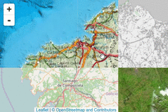

Leaflet.Sync
============

Synchronized view of two maps. Tested with Leaflet 1.0.3, 1.1.0 and 1.2.0.

[More information in original blog post by @turban](http://blog.thematicmapping.org/2013/06/creating-synchronized-view-of-two-maps.html)

Installation
------------

Using npm for browserify `npm install leaflet.sync` (and `require('leaflet.sync')`), or just download `L.Map.Sync.js` and add a script tag for it in you html.

Usage
-----

## Two maps.
With two map objects, `mapA` and `mapB`, call `mapA.sync(mapB)` to sync interactions on `mapA` with `mapB`.

In order to make the other direction work, you should make another call: `mapB.sync(mapA)`

When in need to unsync maps simply call `mapA.unsync(mapB)` to release sync interactions on `mapB` and `mapB.unsync(mapA)` to release `mapA`.

## More than two maps
Just make more calls to `map.sync()`, with different map objects. Interaction will be synced to all of them. If you want the actions to be synced vice-versa, you should synchronize all directions.

```JavaScript
// synchronize three maps
mapA.sync(mapB);
mapA.sync(mapC);
mapB.sync(mapA);
mapB.sync(mapC);
mapC.sync(mapA);
mapC.sync(mapB);
```
## Offset
You can synchronize not only the centers, but other points, using the option `offsetFn`.
The parameters send to the function are `(center, zoom, referenceMap, targetMap)`, and it must return the equivalent center to produce your offset. That means, the center to pass to setView.

In most cases, you can use the factory `L.Sync.offsetHelper`, that accepts two arrays of two elements each `(ratioRef, ratioTgt)`. The meaning of this array is the relative position -relative to the top left corner and the whole size- in the map container of the point to synchronize. The first value in the array is for the x axis, where 0 is the left side and 1 the right side. The second value in the array is for the y axis, where 0 is the top side, and 1 the bottom side. So `[0, 0]` is the top left corner, `[0, 1]` is the bottom left corner, `[0.5, 1]` is the middle of the bottom side, `[0.5, 0.5]` is the center of the container, `[0.75, 0.25]` is the center of the top right quadrant, and `[2, 0]` is a point out of the container, one 'width' far to the right, in the top line.
```
 [0,0]------[0.5,0]------[1,0]     ...       [2,0]
   |                       |
 [0,0.5]---[0.5,0.5]---[1,0.5]
   |                       |
 [0,1]------[0.5,1]------[1,1]

```

For instance `mapB.sync(mapC, {offsetFn: L.Sync.offsetHelper([0, 1], [1, 1])});` will sync the bottom left corner `[0, 1]` in the reference map (mapB) with the bottom right corner `[1, 1]` in the target map (mapC).

As well `mapB.sync(mapA, {offsetFn: L.Sync.offsetHelper([0, 0], [1, 0.5])});` will sync the top left corner `[0 ,0]` in mapB with the center of the right side `[1, 0.5]` in mapA.

If you want the actions to be synced vice-versa, you should use symmetric values (as reference and target are swapped); for instance:
```JavaScript
// place B below A, and show a continuous map
mapA.sync(mapB, {offsetFn: L.Sync.offsetHelper([0, 1], [0, 0])});
mapB.sync(mapA, {offsetFn: L.Sync.offsetHelper([0, 0], [0, 1])});
```

The default behaviour is to synchronize the centers, the corresponding offset points are  `[0.5, 0.5], [0.5, 0.5]`.

Have a look at the file [examples/multiple_offset.html](examples/multiple_offset.html) to see how to sync multiple maps with offsets.

If you need a different behaviour not supported by `L.Sync.offsetHelper`, create your own function. For instance, if you have a banner on the left side of mapA 100px width that you want to exclude, you can create something like this:
```JavaScript
mapA.sync(mapB, {offsetFn: function (center, zoom, refMap, tgtMap) {
    var pt = refMap.project(center, zoom).add([100, 0]);
    return refMap.unproject(pt, zoom);
    }
});
```
Another example for `offsetFn` is this function, that will sync all the maps as if they were continuous, like in [examples/select_syncs.html](examples/select_syncs.html)
```JavaScript
function offsetGlobal (center, zoom, refMap, tgtMap) {
    var refC = refMap.getContainer();
    var tgtC = tgtMap.getContainer();
    var pt = refMap.project(center, zoom)
                   .subtract([refC.offsetLeft, refC.offsetTop])
                   .subtract(refMap.getSize().divideBy(2))
                   .add([tgtC.offsetLeft, tgtC.offsetTop])
                   .add(tgtMap.getSize().divideBy(2));
    return refMap.unproject(pt, zoom);
}
```



API
---

### `mapA.sync(mapB, [options])`
Replays all interaction on `mapA` on `mapB` to keep their views synchronized. Initially synchronizes the view of `mapA` to `mapB`.

Optional `options`:
```JavaScript
{
    noInitialSync: true, // disables initial synchronization of the maps.
    syncCursor: true, // add a circle marker on the synced map
    offsetFn: function (center, zoom, refMap, tgtMap) { return center; } // function to compute an offset for the center
}
```

### `mapA.unsync(mapB)`

Removes synchronization.

### `mapA.isSynced([otherMap])`

Returns true if the map is synchronized with any other map. When `otherMap` is present, returns true if the map is synchronized exactly with this `otherMap`.


Known issues
------------

 - Dragging is not propagated more than one level (In a `a.sync(b.sync(c))` situation, dragging on `a` will not result in change on `c`).

Running tests
-------------

Install dependencies and run tests:
```
npm install && npm test
```
or load `test/index.html` in your browser after installing the dependencies by running `npm install`.
